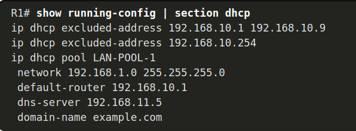
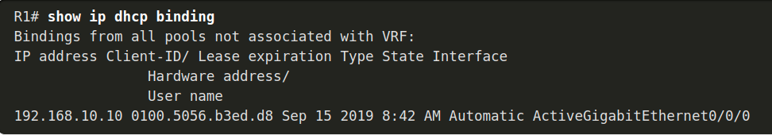
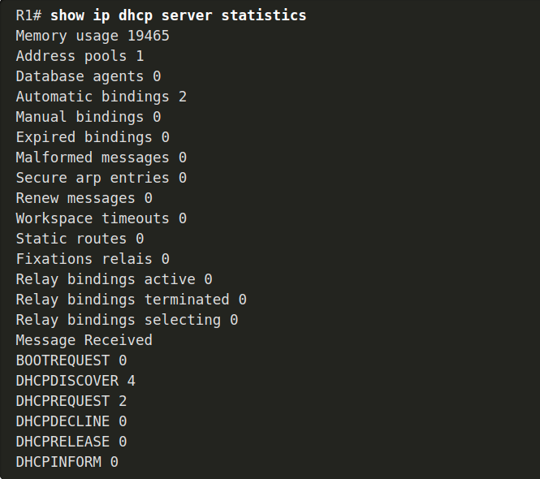
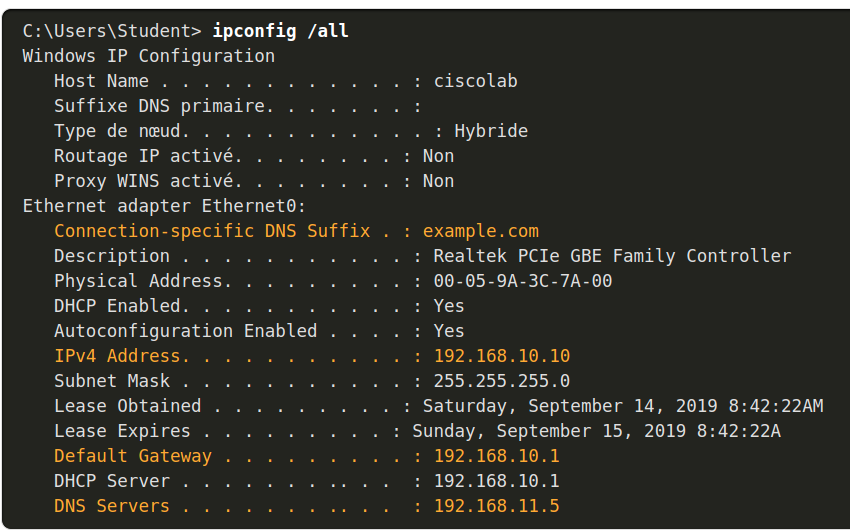
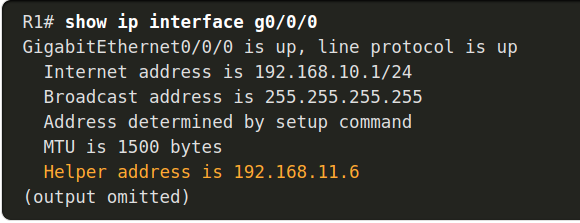
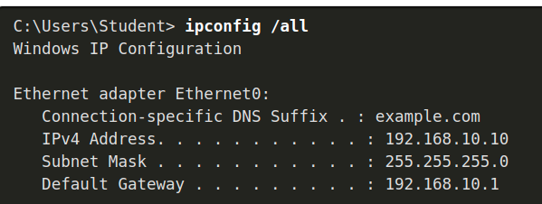

# Cours 7

## Routeur en tant que serveur DHCP

**Exclure les adresses ipv4**<br/>
```
ip dhcp excluded-address low-address [high-address]
```
**Définir un nom de pool DHCPv4**<br/>
```
ip dhcp pool pool-name
```
| tache											 | Commande IOS										|
| ------------------------------------------- 	 | ------------------------------------------------ |
| Définir le pool d'adresses					 | network network-number [mask  / prefix-length]   |
| Définir le routeur ou la passerelle par défaut | default-router address [ address2….address8]     |
| Définir un serveur DNS                         | dns-server address [ address2…address8]          |
| Définir le nom de domaine                      | domain-name domain                               |
| Définir la durée du bail DHCP                  | lease {days [hours [ minutes]] | infinite}       |
| Définir le serveur WINS NetBIOS                | netbios-name-server address [ address2…address8] |

**Exemple**<br/>
```
R1(config)# ip dhcp excluded-address 192.168.10.1 192.168.10.9
R1(config)# ip dhcp excluded-address 192.168.10.254
R1(config)# ip dhcp pool LAN-POOL-1
R1(dhcp-config)# network 192.168.10.0 255.255.255.0
R1(dhcp-config)# default-router 192.168.10.1
R1(dhcp-config)# dns-server 192.168.11.5
R1(dhcp-config)# domain-name example.com
R1(dhcp-config)# end
R1#
```
**Commandes de vérification DHCPv4**<br/>
```
show running-config | section dhcp # Affiche les commandes DHCPv4 configurées sur le routeur.
show ip dhcp binding # Affiche une liste de toutes les liaisons d'adresses IPv4 vers MAC fournies par le service DHCPv4.
show ip dhcp server statistics # Cette commande permet d'afficher le nombre de messages DHCPv4 envoyés et reçus.
```
**Vérifier la configuration DHCPv4**<br/>
<br/>
**Vérifiez les liaisons DHCPv4**<br/>
<br/>
**Vérifier les statistiques DHCPv4**<br/>
<br/>
**Vérifier l'adressage IPv4 reçu par le client DHCPv4**<br/>
<br/>

**Désactiver le serveur Cisco IOS DHCPv4**
```
R1(config)# no service dhcp
R1(config)# service dhcp
```
**Relayge vers un serveur DHCP**
```
R1(config)# interface g0/0/0
R1(config-if)# ip helper-address 192.168.11.6
R1(config-if)# end
```
**Verif**<br/>
<br/>
<br/>

## Routeur en tant que client DHCP
**config**
```
SOHO(config)# interface G0/0/1
SOHO(config-if)# ip address dhcp
SOHO(config-if)# no shutdown
Sep 12 10:01:25.773: %DHCP-6-ADDRESS_ASSIGN: Interface GigabitEthernet0/0/1 assigned DHCP address 209.165.201.12, mask 255.255.255.224, hostname SOHO
```
**verif**
```
SOHO# show ip interface g0/0/1
GigabitEthernet0/0/1 is up, line protocol is up
  Internet address is 209.165.201.12/27
  Broadcast address is 255.255.255.255
  Address determined by DHCP
  (output omitted)
```
